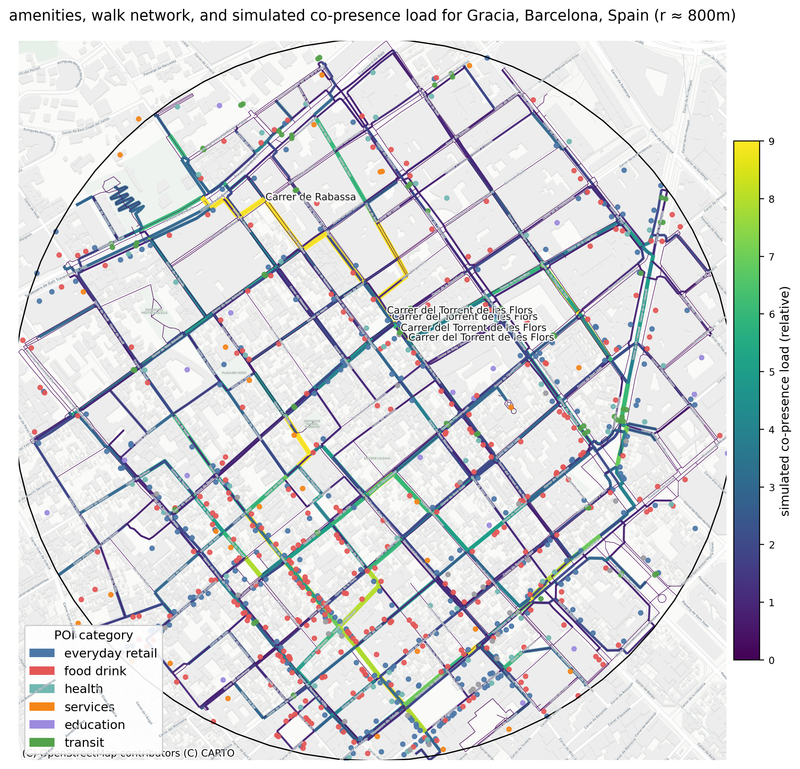

# Weak-Tie Opportunity Structure: A Spatial Methods Prototype

*Example static map png output for a run on Gracia, Barcelona at a radius of 800m.*
```python
[Gracia, Barcelona, Spain] r≈800m
AUI* (grid)=0.455 (occ=0.77, L≈100m, gini_nonempty=0.409); AUI* (net)=0.615 (occ=0.92, step≈50m); NUS=1.000 (method=nodes_all); AccessGini_local=0.235; LUM_no_transit=0.723 (join_share=1.00);
route_entropy=1.097 (norm=0.999); kpaths_edge_cov=0.471; kpaths_len_cov=0.478;
dest_cell_H=0.996; dest_cat_H=0.320; CPP_gini=0.391; top10_share=0.368
```
*Console output from the same run on Gracia.*

**Purpose.** This repo contains the prototype Python script for my proposed Master’s dissertation. This project investigates whether the physical design of a neighbourhood structurally supports or inhibits the formation and maintenance of ‘weak-tie’ social networks. This script is the quantitative aspect of this research, using OpenStreetMap data for a given neighbourhood it calculates novel metrics that measure what I’m calling ‘Weak-Tie Opportunity Structure’.

This model draws from two key theorists:

- Jane Jacobs (1961): In *The death and life of great American cities*, Jacobs argues that safe, vibrant, socially cohesive neighbourhoods depend on a complex “ballet” of repeated, casual, and low-intensity encounters in the public space. This requires a diverse mix of uses, short-blocks, and distinctions between public and private space.
- Mark Granovetter (1973): Granovetter argues that ‘weak-ties’ (acquaintances) are more important than ‘strong-ties’ (family, close friends) for information flow, economic opportunity, and social mobilisation.

The full Master’s dissertation proposal is a mixed-methods study. This script forms the first part of this - a spatial, structural model that quantifies a neighbourhoods potential for spontaneous encounter. The second part will validate the quantitative model against quantitative/qualitative survey and interview data from a sample of residents. This will gather residents’ perceived safety, social trust, sense of belonging, and informal support networks.

**Core Idea.**
Fine-grain, ubiquitous, mixed-use, walkable urban areas should:

- Distribute everyday destinations across the network (ubiquity)
- Keep short-walk access high across most of the network
- Generate varied, redundant routes to different destinations
- Distribute co-presence across the network rather than bottleneck it through a single corridor

**These conditions increase opportunities for weak-tie formation and maintenance through a higher chance for spontaneous encounters with other residents.**

---

## Methods

Given a place name (e.g. Jericho, Oxford, UK) and a radius, the script:

1. Geocodes the place to a point and builds a circle study area of radius `study_radius_m`
2. Downloads the walk network within this circle
3. Pulls OSM points of interest (PoIs) and classifies them into social-use categories
4. Computes indicators of ubiquity, short-walk access, inequality of access, route diversity, path coverage, and co-presence concentration
5. Exports a summary CSV, a static map (PNG), and an interactive map (HTML)

---

## Metrics Cheat-Sheet

| Metric | Meaning | Better weak-tie opportunity structure if… |
| --- | --- | --- |
| AUI_raw (grid) | Evenness of PoIs across adaptive grid cells. | Higher (more even) |
| AUI* | Occupancy-weighted AUI: combines coverage (share of non-empty cells) with evenness among the non-empty cells. | Higher |
| AUI* (network) | AUI* computed by sampling along the walk network (not just Euclidean grid). | Higher |
| NUS | Network ubiquity share: fraction of sampled nodes with ≥ `min_pois_for_service` PoIs reachable within `reach_radius_m`. | Closer to 1.0 |
| Access Gini | Inequality of reachable PoIs across sampled nodes. | Lower |
| Route entropy (norm.) | Diversity among k-shortest plausible paths (per OD). | Closer to 1.0 |
| Edge coverage (share/length) | Share of simplified graph edges/length touched by plausible daily paths. | Higher |
| CPP Gini | Concentration of simulated co-presence on a few links. | Lower |
| Top-10% CPP share | Load carried by top decile of links. | Lower |
| LUM entropy | Land-use mix entropy across viz grid (excludes transit). | Higher |

---

## How are metrics calculated?

### Land-Use Mix (LUM)

1. Snap each PoI to the nearest visual grid cell with sjoin_max_dist_m
2. Count PoIs per functional category across the joined PoIs (excluding transit)
3. Compute normalised Shannon Entropy
    
    
    $entropy:
    \text{LUM} = -\sum_{c} p_c \log p_c \; / \; \log 5$
    
    where Pc is the share of joined PoIs in category c
    
4. `LUM_join_share` = joined PoIs / total PoIs
(just a sanity check on sjoin)

**Interpretation:** 0 = one category dominates, 1 = balanced across daily life categories

### Amenity Ubiquity Index (Adaptive Grid)

1. Size an adaptive square grid inside the study circle
    1. Target = ~`target_pois_per_cell` PoIs per cell
    2. Solve for cell length
        
        
        $L=\sqrt{\text{area}/N_{\text{cells}}}$
        
        Clamp to `[cell_min_m, cell_max_m]`
        
    3. `AUI_cell_L_m` = L
2. Assign deduped PoIs to the nearest cell
3. Let counts = PoIs per cell; nonempty = counts greater than 0
    1. `AUI_occupancy` = share of cells with 1 or more PoIs
    2. `AUI_raw` = 1 - gini(counts)
    3. `AUI_star` = AUI_occupancy x (1 - gini(nonempty))
    4. `AUI_nonempty_gini` = gini(nonempty)

### Amenity Ubiquity Index (Network)

1. Sample along the walk network every step = max(`aui_network_min_step_m`, `AUI_cell_L_m`/2)
2. Snap samples to graph nodes
3. For each sample node, count PoIs reachable within network radius `AUI_cell_L_m`/2 using Dijkstra’s algorithm on length
4. With counts = reachable-PoI counts over samples, and nonempty = counts > 0
    1. `AUI_occupancy_net` = share with >0 reachable PoIs
    2. `AUI_raw_net` = 1 - gini(counts)
    3. `AUI_nonempty_gini_net` = gini(nonempty)
    4. Also records `AUI_sample_step_m` and `AUI_n_samples`

### Network Ubiquity Share (NUS)

1. Use every node in `G_proj` as an origin exactly once
2. For each node, run Dijkstras algo to `reach_radius_m`, count reachable PoIs
3. A node is served if hits ≥ `min_pois_for_service`
4. `NUS_share` = served_nodes / total_nodes

### Local Access Inequality (Access Gini)

1. Re-use the per-node reachable-PoI counts from NUS
2. Computes
   `access_gini_local` = gini(reachable counts over nodes)

### Route Entropy (k-shortest)

For each sampled origin and sampled destination:

1. On `G_simple`, get up to k_paths shortest simple paths by edge length
2. Convert part costs $(c_i)$ to utilities
   
    $u_i = \exp[-\beta (c_i - \min c)]$
   
4. Convert to probabilities
   
    $p_i = u_i/\sum u$
   
6. Per OD entropy
   
    $H = -\sum p_i \log p_i$
   
8. Aggregate across ODs
    1. `mean_route_entropy` = mean of H
    2. `norm_route_entropy` = `mean_route_entropy` / log(`k_paths`)

### K-Paths Coverage

When computing k-shortest paths (above), collect all edges touched

- `edge_cov_frac` = unique touched edges / total edges in G_simple
- `edge_len_cov_frac` = sum(length of touched edges) / sum(length of all edges)

### Per-Origin Spatial Spread of Destinations

For each origin:

1. Map that origin’s chosen destinations to the visual grid cells (nearest within `sjoin_max_dist_m`)
2. `mean_dest_cell_entropy` = mean over origins
    1. If there are PoIs but an origin collapses to one cell, it contributes 0 not NaN.

### Per-Origin Functional Spread of Destinations

For each origin:

1. Count how many of the five social categories its destinations fall into.
2. Compute normalised entropy over those category counts (/ log 5), or 0 if only one category appears
3. Aggregate
    1. `mean_dest_cat_entropy` = mean over origins

### Co-Presence Potential (CPP) Concentration

1. Build OD pairs (sampled residential origins and sampled PoIs)
2. For each OD, take the single shortest path on G_proj
3. Weight each path by a simple 24hr profile and accumulate on edge-by-hour load matrix
4. Sum hours to get total edge load CPP
5. Compute
    1. `cpp_gini` = gini of positive CPP values across edges
    2. `cpp_top10_share` = sum of loads at or above the 90th percentile / total load

### Counts

For transparency and reproducibility, the CSV also includes:

- `pois_total`, `pois_deduped`, `viz_grid_cells`
- Key parameters
    - `study_radius_m`, `reach_radius_m`, `min_pois_for_service`, `sample_step_m`, `k_paths`, `beta`, `dedupe_radius_m`, `AUI_cell_min_m`, `AUI_cell_max_m`, `nus_method`

### Fallback Handling

- If no PoIs exist, some metrics will return 0 or NaN. The script uses fallbacks to keep the maps rendering when this happens but NaNs that represent ‘not-defined’ are preserved.
- For `dest_cell_entropy`
    - If PoIs exist but an origin’s chosen destinations are in one cell, that origin contributes 0 instead of NaN

 
## Pipeline

1. Study area
    
    Circle polygon of radius study_radius_m around place_name (metric CRS).
    
2. Network
    
    Walk network via OSMnx. This is projected and simplified to a DiGraph with one min-length edge per (u,v) for k-shortest-path calculation.
    
3. PoIs & classification
    
    OSM features reduced to representative points and classified into five social-use categories (plus transit and other). Deduping prevents overcounting multi-tagged places.
    
4. Grids
    - Viz grid: fixed cell size for LUM and residential origin sampling. There is an optional clip to streets via buffered walk-network.
    - Adaptive AUI grid: cell size chosen so expected PoIs per cell ≈ `target_pois_per_cell`, clamped by `[cell_min_m, cell_max_m]`.
5. Indicators
    - AUI_raw / AUI* on the adaptive grid; optional AUI* on the network via along-edge sampling.
    - NUS: `nus_method` of either "nodes_all" (evaluate every node) or "segments_sampled" (sample points along edges every sample_step_m and snap to nearest node).
    - Access Gini from the reachable PoI counts.
    - Route entropy, coverage from k-shortest paths between sampled residential origins and sampled PoIs.
    - CPP via OD shortest paths with a toy diurnal weighting, yields per-edge loads and concentration stats.


## Configuration

Key fields from cfg:

- `place_name` (text string)
- `study_radius_m` (int, metres)
- `crs_metric` (default: "EPSG:3857") (web mercator projection)
- `viz_cell_m`, `clip_grid_to_streets` (bool), `street_buffer_m`, `sjoin_max_dist_m`
- `aui_modes` (list: "grid", "network"), `target_pois_per_cell`, `cell_min_m`, `cell_max_m`, `dedupe_radius_m`, `aui_network_min_step_m`
- NUS: nus_method ("nodes_all" recommended for stability), reach_radius_m, min_pois_for_service, sample_step_m
- Trip structure: `k_paths`, `beta`, `max_origins`, `dests_per_origin`
- Output: `map_zoom`, `outdir`
- `seed` for reproducibility


## Outputs

- outputs/cpp_map_static.png — static basemap with CPP coloring and PoI dots.
- outputs/cpp_map_interactive.html — interactive layers for CPP and PoIs.
- outputs/summary_metrics.csv — one row with metrics and config echoes for auditability.


## Interpreting results

- Ubiquity & access: High AUI* and high NUS, with low Access Gini, indicate broadly distributed day-to-day functionality and equitable short-walk reach.
- Varied encounter structure: High normalised route entropy and substantial edge coverage indicate many plausible, distinct routes to different amenities, promoting repeated but distributed overlap.
- Concentration and distribution: Lower CPP Gini and Top-10% share suggest co-presence is spread across the network rather than funnelled into a single corridor.
- Mix: Higher LUM entropy correlates with a stronger baseline for everyday social mixing but should be interpreted alongside ubiquity and route diversity.

## Data sources & attribution

- OpenStreetMap data via OSMnx (Overpass API).
    
    © OpenStreetMap contributors.
    
- Basemap tiles: CartoDB Positron via Contextily.
    
    © OpenStreetMap contributors; © CARTO.

[See BIBLIOGRAPHY.md for full references](https://github.com/danjunipero/weak-tie-opp-structure/bibliography.md)
[See CHANGES.md for full version history/evolution (and thought processes!)](https://github.com/danjunipero/weak-tie-opp-structure/changes.md)
